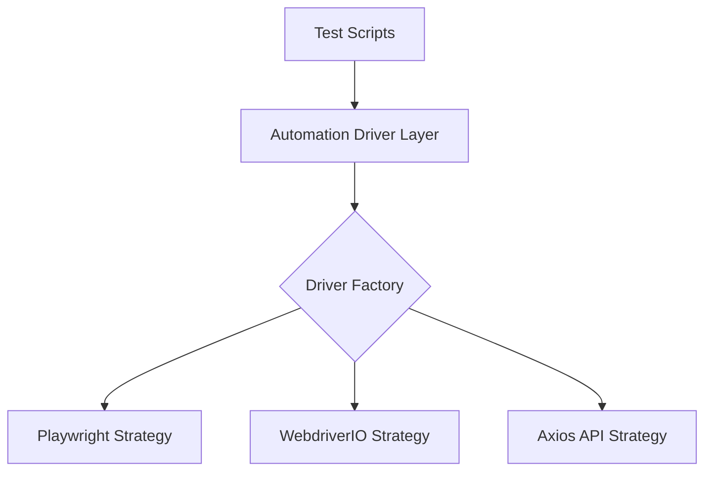

<h1 align="center">🚀 TAFLEX JS</h1>

<div align="center">

**The Enterprise-Grade, Multi-Platform Automation Engine.**

[](https://github.com/vinipx/taflex-js/actions)
[](https://nodejs.org/)
[](https://playwright.dev/)
[](https://webdriver.io/)
[](https://vitest.dev/)
[](https://zod.dev/)
[](https://modelcontextprotocol.io)
[](https://opensource.org/licenses/ISC)

[**Explore the Docs »**](https://vinipx.github.io/taflex-js/)

[Report Bug](https://github.com/vinipx/taflex-js/issues) • [Request Feature](https://github.com/vinipx/taflex-js/issues) • [Community Discussion](https://github.com/vinipx/taflex-js/discussions)

</div>

---

## 💎 Why TAFLEX JS?

**TAFLEX JS** is not just another wrapper; it's a sophisticated automation ecosystem built for scale, speed, and intelligence. By unifying Web, API, and Mobile testing into a single Strategy-based architecture, it allows teams to share patterns, logic, and locators across the entire tech stack.

### ✨ Key Capabilities

*   🌐 **Unified Multi-Platform**: One framework for Playwright (Web), Axios/Playwright (API), and WebdriverIO (Mobile).
*   🤖 **AI-Agent Ready**: Native **MCP (Model Context Protocol)** server integration, allowing AI agents to autonomously run tests and debug failures.
*   📂 **Smart Locators**: Hierarchical, JSON-based locator management with inheritance (Global ➔ Page).
*   🛡️ **Bulletproof Config**: Runtime environment validation using **Zod**—no more "undefined" errors in CI.
*   ☁️ **Cloud Native**: Seamless integration with **BrowserStack**, **SauceLabs**, and **GitHub Actions**.
*   🗄️ **Data-Driven**: Integrated managers for **PostgreSQL** and **MySQL** validation.
*   🤝 **Contract First**: First-class support for **Pact** consumer-driven contract testing.
*   📊 **Deep Visibility**: Plug-and-play reporting for **Allure**, **ReportPortal**, and **Jira Xray**.

---

## 🏛️ Architecture at a Glance

TAFLEX JS leverages the **Strategy Pattern** to decouple your test logic from the underlying automation drivers. Switch from Playwright to another engine without rewriting a single test case.



---

## 🚀 Quick Start

### 1. Instant Setup
Get up and running in 60 seconds with our automated setup script:

```bash
git clone https://github.com/vinipx/taflex-js.git
cd taflex-js
./setup.sh
```

### 2. Run Tests
| Command | Purpose |
| :--- | :--- |
| `npm test` | Run all Web integration tests (Playwright) |
| `npm run test:unit` | Run fast unit tests (Vitest) |
| `npm run test:contract` | Verify API contracts (Pact) |
| `npm run mcp` | Start the **AI-Agent** integration server |
| `npm run docs` | Launch the Docusaurus documentation site |

---

## 🤖 AI-Agent Integration (MCP)

TAFLEX JS is a **Model Context Protocol (MCP)** host. This allows you to connect your test suite to AI assistants like Claude Desktop or IDE agents.

### Quick Connect (Claude Desktop)
Add this to your `claude_desktop_config.json`:

```json
{
  "mcpServers": {
    "taflex": {
      "command": "node",
      "args": ["/absolute/path/to/taflex-js/src/mcp/server.js"]
    }
  }
}
```

Once connected, your AI assistant can autonomously **run tests**, **inspect locators**, and **analyze reports**.

---

## 📊 Enterprise Reporting

We believe that a test framework is only as good as its reports. TAFLEX JS supports multiple formats out of the box:

- **Allure**: Beautiful, interactive HTML reports with trends.
- **ReportPortal**: AI-powered dashboard for large-scale execution analysis.
- **Xray**: Native Jira integration for requirement traceability.
- **JSON**: Machine-readable results for custom CI/CD pipelines.

---

## 🤝 Contributing

We welcome contributions! Whether it's a bug fix, a new feature, or a documentation improvement, please check our [Contributing Guidelines](https://vinipx.github.io/taflex-js/docs/contributing/guidelines).

---

<div align="center">
Built with ❤️ by <a href="https://github.com/vinipx">vinipx</a> and the TAFLEX Community.
<br/>
<i>Engineered for Reliability. Built for the Future of AI.</i>
</div>
